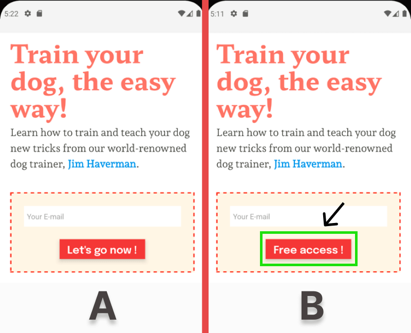

# A/B Testing in React Native - Sample App

#### [Read the blog post here](https://configcat.com/blog/)

This is a demo mobile app built with React Native. In the article, it was used in a demo A/B test experiment where variation B was released to 10% of users to gather metrics. In the end, I demoed how to compare the metrics from each variation to determine which is better.



## Build & Run

1. Clone this repo

2. Start Metro

```sh
npx react-native start
```

3. With Metro running, in a new terminal, start the application

```
npx react-native run-android
```

If everything is set up correctly, you should the app running in your Android emulator shortly.

### Prerequisites
- [React Native Prerequisites](https://reactnative.dev/docs/environment-setup)

### Running the sample app

## Learn more

Useful links to technical resources.

- [React Native Documentation](https://reactnative.dev/docs/getting-started) - learn about React Native and its API.

[**ConfigCat**](https://configcat.com) also supports many other frameworks and languages. Check out the full list of supported SDKs [here](https://configcat.com/docs/sdk-reference/overview/).

You can also explore other code samples for various languages, frameworks, and topics here in the [ConfigCat labs](https://github.com/configcat-labs) on GitHub.

Keep up with ConfigCat on [Twitter](https://twitter.com/configcat), [Facebook](https://www.facebook.com/configcat), [LinkedIn](https://www.linkedin.com/company/configcat/), and [GitHub](https://github.com/configcat).

## Author
[Chavez Harris](https://github.com/codedbychavez)

## Contributions
Contributions are welcome!# abtest-reactnative-sample
